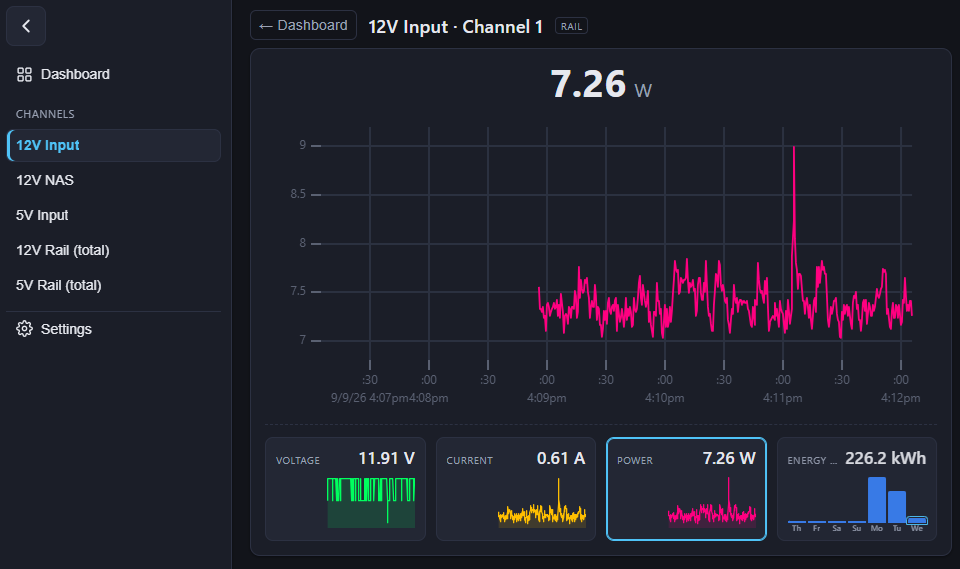
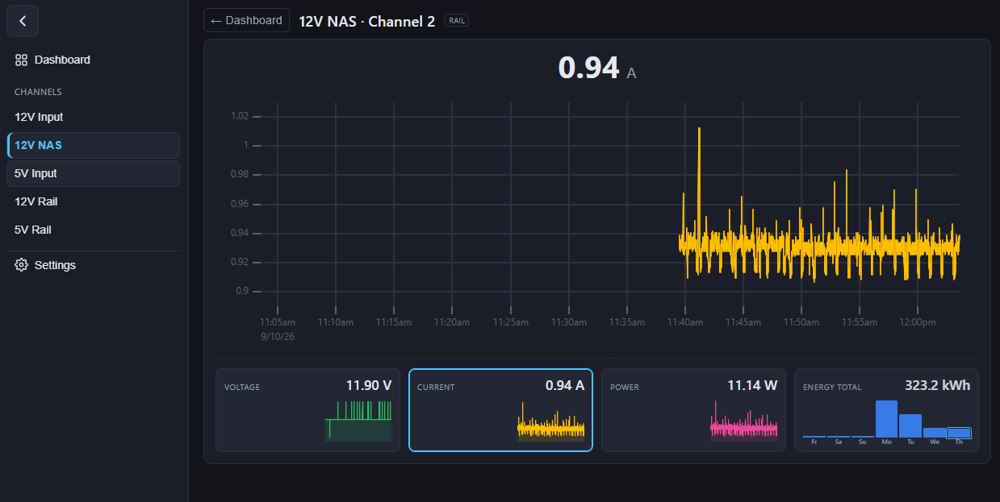

# rpi-power-monitor

Two-part Python project that reads an **INA3221** power sensor (3 I²C channels)
on a Raspberry Pi and shows the data on a **web dashboard** in your browser:

- **`server/`** — runs on the Raspberry Pi (Linux). Reads the INA3221 via I2C,
  computes per-channel voltage / current / power / energy, adds **aggregate
  channels** (rails grouped by a tag), and broadcasts a **raw binary TCP
  stream** (fixed 40-byte frames — easy to consume from C++, scripts, …).
- **`client/`** — a **stdlib-only Python web server**. Connects to
  the Pi's raw TCP stream, keeps the latest reading per channel, and serves an
  offline HTML/JS dashboard over HTTP + **WebSocket**. The WebSocket hands the
  browser its catalog (channels, metric labels/units, chart-buffer depth), the
  Pi's daily energy totals plus live readings; the rolling chart buffers and
  the user's UI choices are browser-side (the latter in a cookie).

## GUI




## Layout

```
rpi-power-monitor/
├── power-monitor.code-workspace
├── README.md
├── .gitignore
├── requirements/            # pip requirements per role
│   ├── common.txt
│   ├── server.txt
│   └── client.txt
├── config/                  # the actual configuration files
│   ├── server.yaml          #   -> edit on the Raspberry Pi
│   └── client.yaml          #   -> edit where the dashboard runs
├── deploy/                  # systemd unit + install helper (Raspberry Pi)
│   ├── rpi-power-monitor.service
│   └── install-service.sh
├── shared/                  # code shared by both sides (contract only)
│   ├── binary.py            #   40-byte binary frame pack/unpack
│   └── catalog.py           #   channel ids/names (from config/server.yaml)
├── server/                  # Raspberry Pi side
│   ├── main.py              #   entry point (read + broadcast + MQTT)
│   ├── config.py            #   typed loader for config/server.yaml
│   ├── energy.py            #   per-channel Wh counters (+JSON persistence)
│   ├── archive.py           #   hourly state snapshots -> energy*.json.tar
│   ├── mqtt.py              #   optional MQTT publisher
│   ├── sensor/
│   │   ├── base.py          #   PowerSensor interface
│   │   └── ina3221.py       #   INA3221 driver (smbus2)
│   └── net/
│       └── tcp_server.py    #   threaded raw-TCP broadcaster (+allowlist)
├── client/                  # web-dashboard side (Windows / Linux / Pi)
│   ├── main.py              #   entry point
│   ├── config.py            #   typed loader for config/client.yaml
│   ├── store.py             #   thread-safe latest-reading store
│   ├── net/
│   │   └── tcp_client.py    #   reconnecting binary-frame TCP reader
│   └── web/
│       ├── server.py        #   stdlib HTTP + WebSocket dashboard server
│       ├── ws.py            #   minimal RFC 6455 (stdlib only)
│       └── static/          #   index.html, app.js, style.css, vendor/uPlot
├── docs/
│   ├── protocol.md          # TCP wire protocol specification (binary)
│   └── client_web.md        # web dashboard: how to run & configure
└── state/                   # energy.json + hourly archive tars (gitignored)
```

## Quick start

Run from the repository root (so the top-level `server`, `client`, `shared`
packages are importable).

**Server (Raspberry Pi):**

```bash
pip install -r requirements/server.txt
python -m server
```

**Web dashboard (any machine that can reach the Pi):**

```bash
pip install -r requirements/client.txt
python -m client
# then open http://<this-machine>:8080/  (see the printed URL)
```

The dashboard connects to the Pi's raw TCP stream (`connection.host/port`) and
serves the UI on `web.host:web.port`. See [`docs/client_web.md`](docs/client_web.md)
for the full configuration guide.

## Run the Pi-side services as systemd units (optional)

The repo includes a helper to install either the server service or the web
client service as a systemd unit. Run these commands **on the Pi** (or on the
machine where the dashboard should run for the client), from the repo root:

```bash
# Server (Raspberry Pi side)
sudo ./deploy/install-service.sh             # install + enable at boot + start
systemctl status rpi-power-monitor
journalctl -u rpi-power-monitor -f           # follow the logs

# Client (dashboard machine)
sudo ./deploy/install-service.sh --client    # install + enable at boot + start
systemctl status rpi-power-monitor-client
journalctl -u rpi-power-monitor-client -f    # follow the logs
```

The helper fills in the real paths/user into the matching unit template and
installs it using the right systemd service name. It auto-detects the repo
owner (the user the service runs as) and a `.venv` python; override with
`--user`, `--group`, `--python` as needed.

- Server uninstall: `sudo ./deploy/install-service.sh --uninstall`
- Client uninstall: `sudo ./deploy/install-service.sh --client --uninstall`

Useful systemd facts for the units:

- The server unit runs `python -m server` from the repo root (working
  directory), so the top-level `server` / `shared` packages and
  `config/server.yaml` + `state/energy.json` resolve as usual.
- The client unit runs `python -m client` from the repo root, so the
  `client` / `shared` packages and `config/client.yaml` resolve correctly.
- Both units are stopped with **SIGINT** (`KillSignal=SIGINT`), which the code
  turns into `KeyboardInterrupt` so they can shut down cleanly. `Restart=always`
  revives them after a crash.
- The server service user must be a member of the `i2c` group to open
  `/dev/i2c-1` (the default Raspberry Pi OS user usually already is):
  `sudo usermod -aG i2c <user>` (then reboot).

## Configuration

- `config/server.yaml` — bind address/port, client allowlist, I2C bus +
  address, physical shunts (name / shunt / aggregate tag), sampling, MQTT
  (optional).
- `config/client.yaml` — Pi address, dashboard bind host/port, display defaults,
  and `server_config` (the `server.yaml` the dashboard reads its channel
  ids/names from — the binary wire carries ids only, never names).

Defaults are filled in with **example wiring**; adjust the channel names, shunt
values, and addresses to your actual hardware before use.

> Status: server (INA3221 sampling, aggregate energy, raw TCP, MQTT) is
> implemented; the client is the new web dashboard